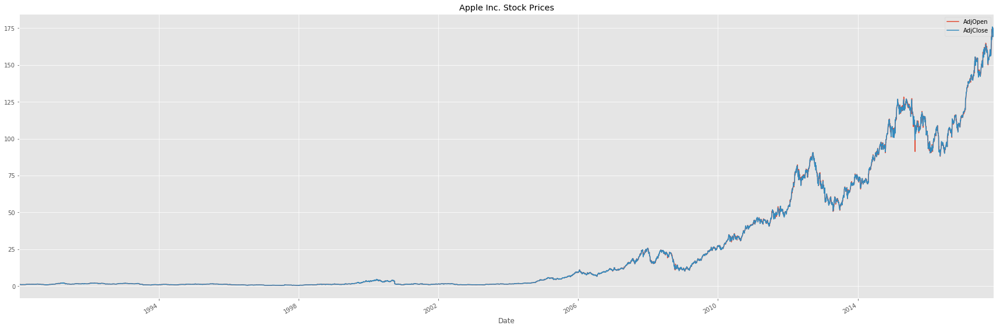
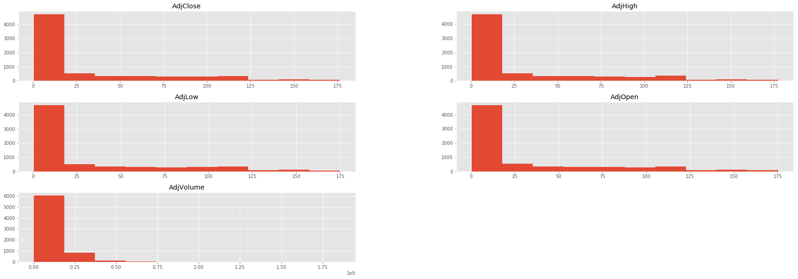
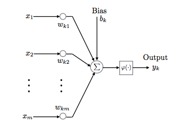
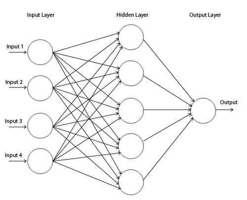
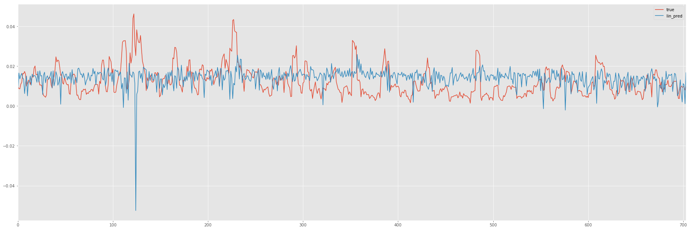
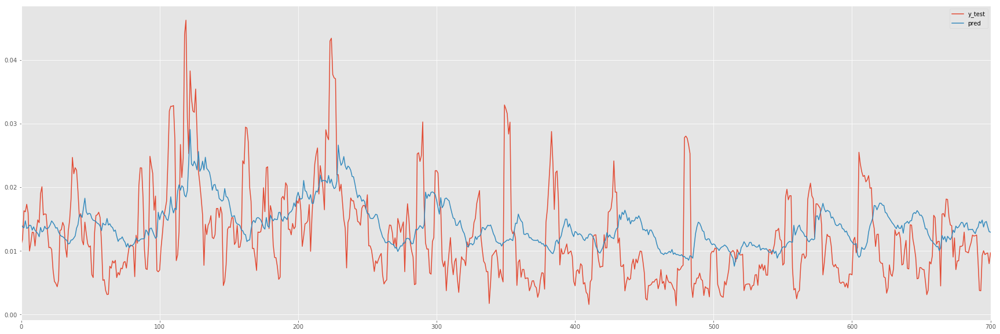
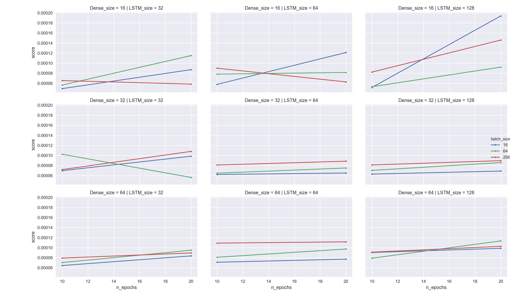
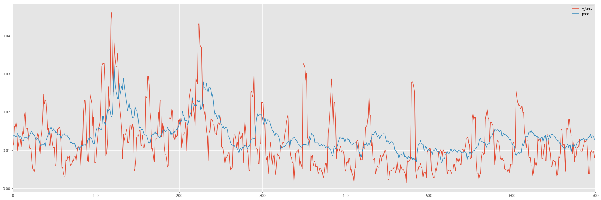
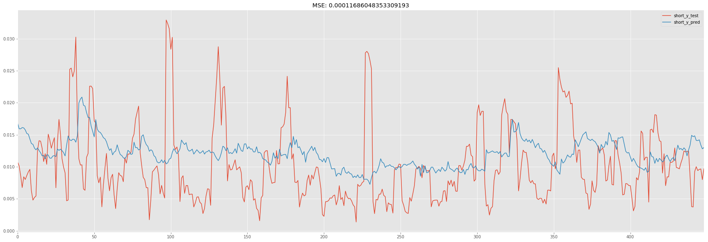

# Mert Karsiyakalilar - Volatility Forecasting using LSTMs
## I. Definition

### **Project Overview**
Financial markets function on consensus established by market prices. It is considered that the market price has all the information about the market participants’ perception of value for the underlying assets (equity, bonds, derivatives etc). Since relationships between assets (ie which assets move together or in opposite direction) are ever changing, forecasting events in markets is a challenging task. Quants have been trying to build models for the past 40+ years to place bets and to diversify risk in portfolios.

With ability to train and deploy advanced machine learning algorithms becoming more accessible thanks to performance improvements in GPUs and being able to use them through economies of scale, cloud computing, deep neural networks has become a good tool attempting to explain events in the financial markets.

Predicting future events using time-series data with deep learning models is not new. In fact there are numerous [academic sources](http://www.iro.umontreal.ca/\~lisa/publications2/index.php/attachments/single/138) as well as [practical](https://github.com/AndysDeepAbstractions/How-to-Predict-Stock-Prices-Easily-Demo) [implementations](http://danielhnyk.cz/predicting-sequences-vectors-keras-using-rnn-lstm/) of such models which has inspired me to take on applying DL to the markets.

### **Problem Statement**
Goal of this project is predicting a 1-week future return volatility for US equities. [Volatility](https://www.investopedia.com/terms/v/volatility.asp) in financial markets is an important concept for investors, as it describes **risk** in terms of standard deviations from an expected return which defines a range where an investment can go. In other words, larger the standard deviations of returns for an asset, larger the risk an investor would be undertaking by investing in such asset. This is also the reason why investors prefer assets with lower risk (lower standard deviation) for a given level of return suggested by a set of opportunities.

Long-Short Term Memory Networks, a special type of Recurrent Neural Networks which are kinds of Multi-Layer Perceptrons (discussed under [Algorithms and Techniques](#algos)), have recently been successful in sequence-to-sequence tasks such as language [translation, voice recognition and image captioning](https://distill.pub/2016/augmented-rnns/). Modeling the volatility in the financial markets as sequences of events, LSTMs look to be a natural fit for this task.

By using trading volume, daily returns calculated in day-over-day percentage differences and calculated ex-post volatility ([realized](https://www.nuffield.ox.ac.uk/economics/papers/2008/w13/wiley.pdf)) I will be building Long-Short Term Memory Networks (LSTM) to predict the future volatility (ex-ante) of single-name US equities

### **Metrics**
Since I’m trying to predict a level of volatility (regression) instead of classifying a return direction (binary classification) I will be using Mean Squared Error (MSE) as the metric for networks to improve on.

A formal definition of MSE can be seen as below ([Wikipedia](https://en.wikipedia.org/wiki/Mean_squared_error)):

> In statistics, the mean squared error (MSE) or mean squared deviation (MSD) of an estimator (of a procedure for estimating an unobserved quantity) measures the average of the squares of the errors or deviations—that is, the difference between the estimator and what is estimated.

## II. Analysis
### Data Exploration and Preprocessing

Let’s first talk about the source of data I am going to be using. Keeping the main focus of this project on building models, I will try to keep the data-pipeline as lean as possible. ```Quandl``` has a neat API which allows users to download single-name historical OHLC prices and volumes easily. I will be using ```pandas-datareader``` to request OHLC price dataframes from Quandl.

Specifically, I will be using stock prices of Apple but this study can easily be extended to any other equity that can be pulled via Quandl. Since APPL has been around for a long time I will try to go back as much as possible and although their IPO was in 1980, I will limit the data to the beginning of 1990 which should be fairly long history to capture events like Tech crash and 08’ crisis. Furthermore, I will use the most recent 10% of the data as my test set and the remaining 90% will be split 90-10 as training and validation sets.



Before we make any adjustments to the raw data let's take a look at the distributions of the estimators and how they compare amongst one another.

```python
import pandas_datareader.data as web

# _ get data from Quandl
eq = web.DataReader('AAPL', 'quandl', '1990-01-01', '2017-12-31')
eq = eq[['AdjOpen', 'AdjHigh', 'AdjLow', 'AdjClose', 'AdjVolume']]
eq.sort_index(inplace=True)
```



Given the sheer size and the differences between prices and volumes, it is necessary to normalize the features to build successful models. Thus, features will include percentage changes of OHLC prices, log returns of daily trading Volume (nominal percentage differences are still significantly larger compared to price differences) and rolling window standard deviation of AdjClose percentage changes (as they represent observed volatility of daily returns). My target will be the same volatility series shifted for my forecast window. It is important to note that I am not leaking future information in my features, but using the future observed vols as the target.


All the above steps easily can be done with the help of pandas.

```python
# _ normalize the features
WINDOW_SIZE = 5
norm_eq = eq[["AdjOpen", "AdjHigh", "AdjLow", "AdjClose"]].pct_change()
norm_eq.replace([np.inf, -np.inf], np.nan, inplace=True)
norm_eq["AdjVolume"] = np.log(eq["AdjVolume"]).pct_change()
norm_eq.fillna(0., inplace=True)

# _ calculating close-to-close returns explicitly
RETURN_WINDOW = 5 
returns = eq['AdjClose'].pct_change()
returns.name = "returns"

# _ calculate observed volatility
volatility = returns.rolling(RETURN_WINDOW).std()
volatility.name = "ex_post_volatility"

# _ shift observed volatility to create target volatilities
FORECAST_WINDOW = 5
lookahead_volatility = volatility.shift(-FORECAST_WINDOW)
lookahead_volatility.name = 'ex_ante_volatility'

input_data = pd.concat([norm_eq, volatility, lookahead_volatility], axis=1).dropna()
```

Let's take a look a the data post-normalization


Now that we have transformed our data so that each feature will be able to contribute to the model, we're ready to proceed to deciding on benchmark models and designing LSTM architectures.


### <a name="algos"></a>Algorithms and Techniques

This part will consider theoretical basis of Single and Multilayer Perceptrons (MLP) as well as how they can be utilized in order to build more complex structures such as Recurrent Neural Networks and Long Short Term Memory Networks.

Single Neural Perceptrons are built on linear combination units where results are passed through a hard limiter that is differentiable[\[1\]](https://www.math.kth.se/matstat/seminarier/reports/M-exjobb15/150612a.pdf). Let's say the limiter returns 1 for all positive numbers and 0 for everything else, we can make forward passes from the network and compare these results with observed values for all the features we have combined using the perceptron. Using this *error*, we can calculate gradients for weights and find the weights that would get us to a smallest error value. This process is called backward propagation and uses Stochastic Gradient Descent to find optimal weights and *learn* decision boundries for these two classes `[1, 0]`

<center></center><br>

Next iteration of such networks include more layers to better represent non-linear relationships in the data. While these networks use the same forward and backward propagation and are widely used in complex image recognition tasks, are unable to explain historical relationships in the data as they do not have a *memory*. In other words, they consider everything all at once.

<center></center><br>

RNNs chain previous states of the network together in a series. By considering information from the previous states of the network and finding correlations between events, RNNs can establish long-term dependencies. 

Source: https://deeplearning4j.org/lstm
<br>

This type of network is fit much better for sequencing problems but RNNs also suffer from a known problem called exploding and vanishing gradients. During training while weight gradients are calculated for the previous and current states of the network, gradients can either get too large (exploding) or get too small (vanishing) which hinders the networks ability to learn. https://colah.github.io/posts/2015-08-Understanding-LSTMs/

Put more eloquently (https://deeplearning4j.org/lstm#vanishing)

> Everyone who has studied compound interest knows that any quantity multiplied frequently by an amount slightly greater than one can become immeasurably large (indeed, that simple mathematical truth underpins network effects and inevitable social inequalities). But its inverse, multiplying by a quantity less than one, is also true. Gamblers go bankrupt fast when they win just 97 cents on every dollar they put in the slots.

> Because the layers and time steps of deep neural networks relate to each other through multiplication, derivatives are susceptible to vanishing or exploding.

To overcome the vanishing gradient problem, in mid-90s researchers Sepp Hochreiter and Juergen Schmidhuber have introduced Long-Short Term Memory Units which utilize gated cells instead of a straight flow of information to-and-from previous states of the network. Much like the whole network, these gated cells, based on the inputs they receive can learn allow or deny parts of the information to be pertained or to be forgotten before letting data pass through. This process of letting some information drop out of the network is useful for distingushing relationships between those that are useful to keep or those that are not according to what we're trying to achieve with the network. 

Resources:

https://deeplearning4j.org/lstm

http://colah.github.io/posts/2015-08-Understanding-LSTMs/

Since our goal is to predict future volatility based on the historical relationships within the data, LSTMs makes the most sense within the models

### Benchmark

Due to it's straight forward nature, one of the most common (and perhaps overused) modeling techniques in investing is linear regression, I will be following this lead and use the `LinearRegression` classifier from `sklearn` to create a benchmark model and evaluate it with `sklearn.metrics.mean_squared_error`

```python
from sklearn.linear_model import LogisticRegression
lin_reg = LinearRegression()


X = input_data[['AdjOpen', 'AdjHigh', 'AdjLow', 'AdjClose', 'AdjVolume', 'ex_post_volatility']]
Y = input_data['ex_ante_volatility']

train_end = int(X.shape[0] * .9)

lin_X_train, lin_X_test = lin_X[:train_end], lin_X[train_end:]
lin_Y_train, lin_Y_test = lin_Y[:train_end], lin_Y[train_end:]

# _  fit the model
lin_reg.fit(lin_X_train, lin_Y_train)

# _ make predictions
lin_pred = lin_reg.predict(lin_X_test)
```

Here is how it looks `MSE: 8.0768333011583258e-05`




## III. Methodology

### Implementation

For implementation of LSTMs I will be using `Keras` which provides abstractions on `Tensor` constructs. 

While preparing data for LSTMS we should consider an embedding layer for our observations instead of feeding the entire series to the model. In other words, we should consider chunking our dataset into smaller pieces create a series of observations to predict a sequence.

An example might explain better. Consider we have the following series,

```
series = [1, 2, 3, 4, 5, 6, 7, 8, 9, 10]
targers = [111, 99, 88, 77, 66, 55, 44, 33, 22, 11]
```

Instead of feeding `series` altogether we should chunk it into a set of samples with a constant embedding size (not to be confused with `word2vec` like representations of words and phrases in vector form). Embedding here refers to a constant window which constitutes as a sample fed into the model. If we use embedding size 2, `series` would look like `[1, 2], [2, 3], [3, 4] ..` and our targets would be `[99, 88, 77 ..]`.

For our forecasting model, I will be using `EMBED_SIZE = 30` with 30 referring to the number of days to predict future volatility.

```python
X = input_data[['AdjOpen', 'AdjHigh', 'AdjLow', 'AdjClose', 'AdjVolume', 'ex_post_volatility']]
Y = input_data['ex_ante_volatility']

def normalize_data(X, Y, LOOKBACK_WINDOW):
    """
        Normalizes Xs and Ys for LSTM
        Returns np.array s that hold X samples where
        in each element of the X array are LOOKBACK_WINDOW many elements
        and this points to a single Y
        ie. if I had X = [1, 2, 3, 6, 7] and Y = [1, 2, 3, 4, 5] and LOOKBACK_WINDOW = 2 then
        _X = [[1, 2], [2, 3], [3, 6], [6, 7]] _Y = [2, 3, 4, 5]
    """
    _X = X.dropna()
    _Xs = []
    _Ys = []
    for i in range(_X.shape[0] - LOOKBACK_WINDOW):
        cur_X = _X.values[i:i + LOOKBACK_WINDOW]
        _Xs.append(cur_X)
        
        y_pointer = i + LOOKBACK_WINDOW
        cur_Y = Y.values[y_pointer]
        _Ys.append(cur_Y)
    return np.array(_Xs), np.array(_Ys)

EMBED_SIZE = 30
x, y = normalize_data(X, Y, EMBED_SIZE)

x_train, x_test = x[:int(len(x) * .9)], x[int(len(x) * .9):]
y_train, y_test = y[:int(len(y) * .9)], y[int(len(y) * .9):]
```

So, given our features are `['AdjOpen', 'AdjHigh', 'AdjLow', 'AdjClose', 'AdjVolume', 'ex_post_volatility']` and `EMBED_SIZE` is `30` our `input_shape` is (30, 6).

For this initial model, I will be using a single layer LSTM with 2 Dense layers.

```python
from keras.models import Sequential
from keras.layers.core import Dense, Dropout
from keras.layers.recurrent import LSTM
from keras.callbacks import ModelCheckpoint, ReduceLROnPlateau
from keras.optimizers import Nadam

# _ build the model
dropout_prob = .5

_data_shape = (30, 6)

model = Sequential()
model.add(LSTM(128, input_shape=_data_shape, return_sequences=False))
model.add(Dropout(dropout_prob))
model.add(Dense(16, kernel_initializer='uniform', activation='relu'))
model.add(Dense(1, kernel_initializer='uniform', activation='linear'))

opt = Nadam(lr=0.002, clipnorm = .1)
reduce_lr = ReduceLROnPlateau(monitor='val_loss',
							  factor=0.9, patience=50, min_lr=0.000001, verbose=1)
checkpointer = ModelCheckpoint(monitor='val_loss',
							  filepath="model.hdf5", verbose=1, save_best_only=True)

model.compile(optimizer=opt, loss='mse')

```


As the optimization function I will be a version of the commonly used RMSprop for RNNS, [Nadam](https://keras.io/optimizers/) which iterates on dynamically adjusts learning based on momentum. Initial batch size, amount of data fed from the sample at 16.


```python
# _ fit the model
history = model.fit(
    x_train,
    y_train,
    batch_size=16,
    epochs=20,
    validation_split=0.1,
    callbacks=[reduce_lr, checkpointer],
    verbose=1)

# _ load the model and make predictions
model.load_weights("model.hdf5")
y_pred = model.predict(x_test)
pred_df = pd.DataFrame(np.column_stack([y_test, y_pred]), columns=["y_test", "pred"])

```



`MSE: 5.0762546538954758e-05`

### Refinement

Above is a good start but I also want to conduct hyper-parameter optimization to make sure my architecture is in fact suitable for this task.

I will be creating versions of the model by combining different parameters below and find the model with the lowest MSE score

```python
lstm_sizes = [32, 64, 128]
dense_sizes = [16, 32, 64]
batch_sizes = [16, 64, 256]
input_shape = (30, 6)
epochs = [10, 20]
```



My original setup was a close second within this search. Here's the best performing model `MSE: 4.93557112e-05` with LSTM



Given the success of a smaller LSTM size, I also want to see if stacking LSTM layers will help learning temporal representations of the data better

Models with 2-layer and 3-layer LSTMs trained with same parameters as before scored respectively, 7.774387669263994e-05 and 5.1214208317167933e-05 were not able to beat the single layer LSTM.

## IV. Results

### Model Evaluation and Validation

One way of checking sensitivity of the model is truncating the input data and see if the model still performs. For this, instead of using the entire history, I'll chop initial 10 years of the data.



Model with trained on less data certainly performed more poorly compared to the ones with long history. It is safe to say more data fed into the LSTMs, better they become on predicting events. 


### Justification

After trying various architectures and looking at the benchmark linear model results, we can conclude the best LSTM we could create out of the conducted experiments is ~1.5x better than the linear model. Compared to the linear model which suprisingly scored as low as it did, LSTM definitely captures the general trend of the volatility changes much better. While 


## V. Conclusion

### Reflection
It has been very interesting to build the linear and the LSTM models for volatility forecasting. I spent the most time doing the exploratory analysis and understanding how features effected learning in the LSTM model. Also deciding on the target has been interesting as volatility by its nature is regime dependent and a linear model can do a good job by predicting a 30-day lookback volatility, setting the problem to predict *future volatility* reveals the true power of deep learning methods capturing underlying relationships within the series.


### Improvement
As it is rather easy to overfit models in financial modeling, one way of improving model's robustness would be adding L1 and L2 regularizations to the LSTM layers to generalize better.


References:

- https://github.com/llSourcell/How-to-Predict-Stock-Prices-Easily-Demo/blob/master/stockdemo.ipynb
- https://github.com/etai83/stock-future-value-ANN-LSTM/blob/master/Google%20Stock%20prediction%20-%20future%20values.ipynb
- http://vict0rsch.github.io/tutorials/keras/recurrent/
- http://danielhnyk.cz/predicting-sequences-vectors-keras-using-rnn-lstm/
- https://medium.com/machine-learning-world/neural-networks-for-algorithmic-trading-2-1-multivariate-time-series-ab016ce70f57
- https://keras.io/getting-started/functional-api-guide/
- https://github.com/Rachnog/Deep-Trading
- https://becominghuman.ai/neural-networks-for-algorithmic-trading-multimodal-and-multitask-deep-learning-5498e0098caf
- http://ruder.io/multi-task/index.html#usingthefuturetopredictthepresent
- https://github.com/kylejusticemagnuson/pyti
- http://cs229.stanford.edu/proj2009/ShinLee.pdf
